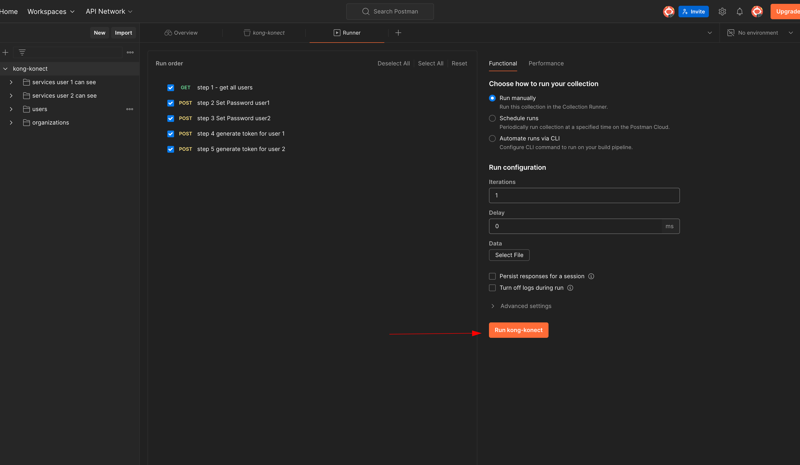

## How to run it

1. Run the following command in the terminal, from the root of the project (not )

```bash

docker network create kong-network
docker compose -f kong-demo-support/docker-compose.yml up -d
```

2. Import the Kong collection in Postman
3. While in Postman, "Run Folder" users,
   this will set password for the 2 users,
   generate the JWT token for the 2 users,
   and set the JWT token in the collection variables



4. Manually run the Services folders in postman


---
### IMPORTANT
I have not write any tests, bucause this POC started to take a lot of time, to do it properly, not just the testing part, but to make it robust and production ready. So i did the bare minimum requested, making sure i show my experience behind it, and not just to create a CRUP application.

In this POC i considered that security was more important than writing tests, as writing tests is a can always be done later on, but security (just like performance) doing it later on, could easily mean "we need to rewrite the entire application".

### Considerations
In will start with: this is the first time i have **ever** used NestJS, did my best to follow the best practices, based on NestJS documentation.

I have created the database, tables and data separately, because usually we have already a database to witch we need to hookup, and use some of the existing data, like the users table.
Also by doing so, the microservice and database are decoupled, and the database can be used by other services as well, and the microservice a bit more stateless so less accidents can occur.

**UUID**: Postgress 12, has no native support for UUID, so the easy way to do it in this version is to just use a `serial primary key`, which is an auto incrementing integer.
This is a possible sercurity/privacy concern, as anyone can guess the number of services we have in the database.
Also in case of a bug/regression, where the guard is not working correctly, a user can get the list of services of other organizations.
So having a UUID for the services, is a good practice for security/privacy reasons.

**AUTH**: The authentication is just a basic one, is just to allow me to create the POC faster. A well thought authentication/authorization system is very hard to do, with a lot of  decision to be made along the way. I have considered that a simple one is enough for this POC.
Not all endpoints are protected, this is by design for this POC. Listing all organizations and all users is a security concern, but for this POC is ok.

**ENDPOINTS**: maybe i should have done some tests, so that i could verify some edgecases, and make sure i return the correct payload each time (especially in case of errors)

**TypeORM**: in some cases i have used the `.find()`, `.findOne()` methods, in other i have used the `.createQueryBuilder()` method, and in the case of the services i have used the `.query()` method. I did tried to use the `.find()` or `.createQueryBuilder()` methods, but i was not able to create a where condition for this conditions:
``` 
organizationId = :organizationId AND (name ILIKE :search OR description ILIKE :description)
```
That encapsulated `OR` i was not able to do it with the `.find()` or `.createQueryBuilder()` methods, so i have used the `.query()` method.
Also a strange behavior i have encountered with `.query()` when using the `ORDER BY` with paramenters, it did not work, so in the end i have just embeded into the query string.
All the querys are parametrized, but i am not sure if they are safe from SQL injection, i have not tested that.
I did used the Validation as the documentation suggested, but since the paramiters for LIKE/ILIKE require me to insert special characters, directly into the parameters, i am not sure how much i can trust it.
Better sanitization and validations should be done, in a real world scenario.

### trade-offs

In the endpoint `/services/:id/versions/:versionId`
I nicer way could have been to use the version number as a query parameter instead of the versionId. I mean the url would have looked less cryptic.

Using the versionId, has it own perks, like for example, if the deletion of a versions is not a hard deletion, but just a column with a state `deleted`. 
Now imagine that the state did not update correctly for some reason, now the query would have returned 2 versions with the same version number, but different name/description (or worst). Using the version number as a query parameter would give the user no way to select the prefered one.


